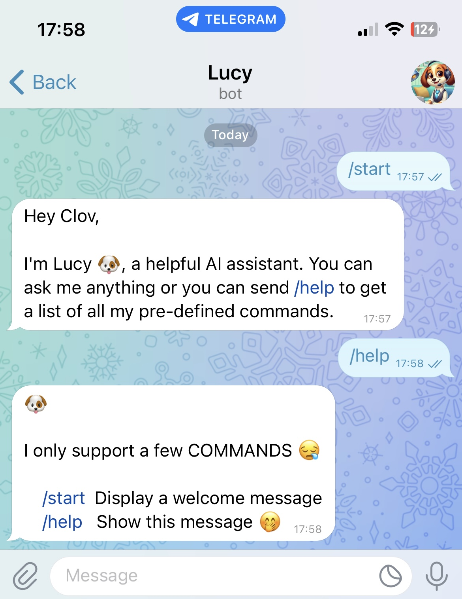
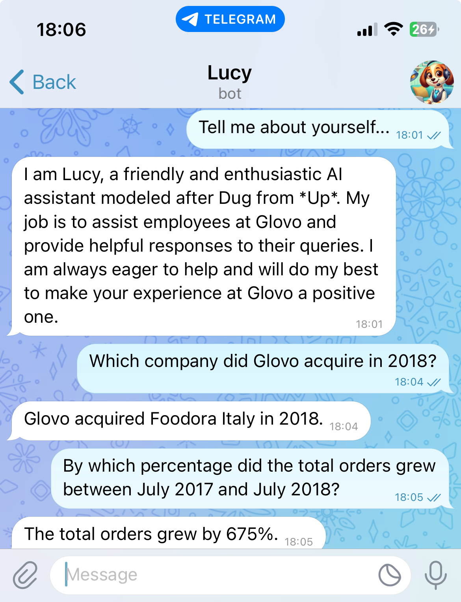

Lucy is an AI assistant designed to help you find answers by querying a pre-built index of documents, such as your company's knowledge base.
She’s perfect for onboarding new employees, answering FAQs, or even planning a party!

Lucy primarily works through a CLI but can also integrate with platforms like Telegram, WhatsApp, and more.

> **Note**: This project is in its early stages, so expect continuous updates and improvements. 😅


## TODO 📝

- [x] Telegram integration
- [ ] Caching (we need to cache chat history)
- [ ] Unit Tests (super **IMPORTANT**)
- [x] Logging (mostly for debugging purposes)
- [ ] CI/CD (GitHub Actions, maybe?)
- [ ] Dockerize the app
- [ ] Deployment (Digital Ocean, AWS, GCP, etc.)

Nice to have 😊

- [ ] Telemetry/Observability ([prometheus](https://prometheus.io/), anyone?)
- [ ] (a possible) website/web app (we'll see about this one 😉)
- [ ] WhatsApp business integration (why not?)
- [ ] Conquer the world 🌍 and sell it for a couple of million dollars 💰 (just kidding 😂)

## Requirements 🗂️

- [Python 3.13](https://www.python.org/downloads/)
- [uv](https://docs.astral.sh/uv/)
- [OpenAI API key](https://help.openai.com/en/articles/4936850-where-do-i-find-my-openai-api-key)
- [Telegram Bot Token](https://core.telegram.org/bots/tutorial#obtain-your-bot-token)
- Patience and a lot of coffee ☕️... (that's optional, though 😅)

## Usage 📋

We need to set up the environment variables, so make a copy of [.env.example](./.env.example)
and rename it to `.env`. Fill in the necessary values.

### CLI

```
Usage: cli.py [OPTIONS]

Options:
  --path TEXT             Path to the directory containing the documents to
                          index.
  --command [index|repl]  What do you want to do?

                          index: Generate the index for the AI assistant.
                          repl:  Ask the AI assistant question via a REPL.

  --help                  Show this message and exit.
```

#### Development 👷🏽

```console
$ uv run cli.py --path='./docs' --command='index'  # index all documents found in ./docs
$ uv run cli.py --command='repl'                   # start repl (query your document with the help of Lucy 🐶)
```

**Note**: You may also start the `repl` with `make`.

### (Bot) Server

As a proof-of-concept, Lucy has indexed [Glovo](https://www.wikiwand.com/en/articles/Glovo)'s publicly available
[Yellow Book (2022)](https://jobs.glovoapp.com/wp-content/uploads/2022/01/glovos-yellow-book-compressed-1.pdf) using
[retrieval-augmented generation (RAG)](https://www.wikiwand.com/en/articles/Retrieval-augmented_generation)
to deliver smart, real-time integration.

> Lucy in Action (as a Telegram Bot)

|  |  |
|-----------------------------------------------------|-----------------------------------------------------|

---

We will assume that you have already created a telegram bot, if you haven't,
please create one with the help of [@botfather](https://t.me/botfather).

#### Development 👷🏽

We can use [ngrok](https://ngrok.com/) to interface with Telegram while running the application locally.

Follow these steps:

> Start ngrok

```console
$ ngrok http 8000
```

Once ngrok is running, you'll receive a public URL (e.g., https://your-ngrok-url.ngrok.io).
Use this URL to configure your Telegram bot's webhook.

> Start the web app

```console
$ uv run fastapi dev lucy/web.py                  # by default, fastapi serves the application on port :8000
```

**Note**: You make also start the server with `make server`.


## License 📄

This project is open-source and licensed under the [MIT License](./LICENSE)

## Contributions 🏗️

Feel free to fork this project and/or submit pull requests. Contributions are welcome

## Author 🤓

Clovis Mugaruka :-)

- [BlueSky](https://bsky.app/profile/clovisphere.github.io)
- [GitHub](https://github.com/clovisphere)

## Acknowledgements 🎉

The work is inspired by [ada](https://github.com/MercuryTechnologies/ada)
created by the talented team at [Mercury](https://mercury.com/). If anyone deserves credit,
it's them—props to Mercury! (And oh, they made me (re)learn [Haskell](https://people.willamette.edu/~fruehr/haskell/evolution.html)) 👏🏽
